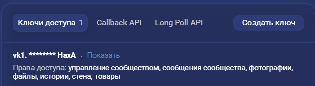
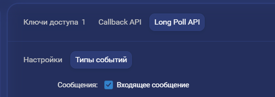

## VK-AI-Assistant

Небольшой виртуальный помощник по программированию, созданный для того, чтобы помогать с решением кодерских задач, предоставлять советы по коду и помогать в отладке. Реализован в виде бота для группы в ВКонтакте на основе библиотеки `vkbottle` для Python.

#### Развертывание

Для начала необходимо создать группу в ВКонтакте и добавить новый API ключ

|    |  |
| ------------------------------------ | ------------------------------------ |

Далее нужно включить `Long Poll API` и в типах событий выбрать 'Входящее сообщение'

|  |  |
| ------------------------------------ | ------------------------------------ |

После получения и настройки ключа добавляем его в `.env` файл, который создаётся по примеру ниже или в соответствии с `.env.template`. Для доступа к нейросети нужен ключ от API для OpenAI, либо API, являющегося посредником. 

```bash
### vk bot
VK_API_KEY=

### openai
OPENAI_API_KEY=
OPENAI_API_URL=
```

Для запуска проекта просто собираем и запускаем контейнеры. Если всё было сделано правильно, после сборки можно будет написать в чат группы и получить ответ.

```bash
docker compose up --build
```